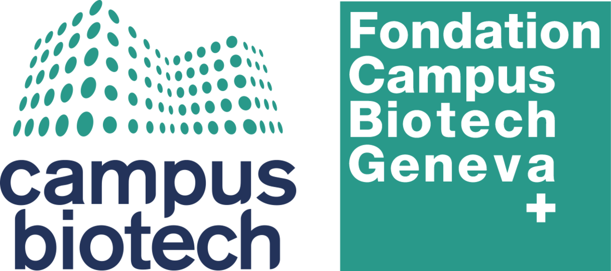

# MOSAIC

**Multi-camera Observatory for Social & Activity Interaction Capture**

[](https://github.com/fcbg-platforms/mosaic/actions/workflows/ci.yml)

A synchronized multi-camera + audio recording suite for research labs, built around Basler
GigE cameras, with live pose/gaze preview, post-recording analysis, and parallel-port/serial
trigger integration for syncing with external systems (e.g. EEG amplifiers).

## Capabilities

- Synchronized capture from multiple Basler GigE cameras (per-camera settings: exposure, gain,
  ROI, pixel format, hardware trigger input)
- Multi-microphone audio recording alongside video
- Post-hoc frame-accurate cross-camera sync (`sync_manifest.json`), with per-camera and
  per-frame timestamp logs
- Keyboard, serial, and parallel-port trigger sources, with a session-wide trigger event log —
  parallel ports can also send a recording start/stop marker back out to an external device (e.g.
  an EEG amplifier's trigger channel)
- Post-hoc EEG-trigger-to-camera-frame lookup (Analysis tab's "EEG/Trigger ↔ Frame Sync" plugin)
- Live in-app pose & gaze preview (MediaPipe, CPU) during acquisition
- Post-recording batch pose/motion analysis (`analysis/`: YOLOv8-pose, centroid tracking,
  heatmaps)
- Checkerboard camera calibration
- Per-user/lab-group login profiles, each with fully isolated settings
- Session browser + synchronized multi-camera playback

## Requirements

The base build (UI, settings, profiles, tests) only needs Qt + CMake. Everything else is an
opt-in `MOSAIC_ENABLE_*` flag — see [Feature flags](#feature-flags) below.

| Tool | Version | Needed for |
|---|---|---|
| CMake | ≥ 3.25 | always |
| C++ compiler | MSVC 2022 / GCC 13 / Clang 17 (C++23) | always |
| Qt | 6.4+ (Core, Gui, Widgets, Network, Multimedia, Quick, QuickWidgets) | always |
| vcpkg | — | GTest, OpenCV, FFmpeg |
| Basler Pylon SDK | 7.x | `-EnableCameras` |
| FFmpeg | via vcpkg (`x264` feature) | `-EnableFfmpeg` |
| OpenCV | 4.x via vcpkg | `-EnableOpenCV` (calibration) |
| CUDA + NVIDIA driver | — | `-EnableNvenc` |

All optional features compile with stub fallbacks when disabled — you can develop and test the
full UI without any lab hardware attached.

## Building

```powershell
# 1. Clone
git clone https://github.com/fcbg-platforms/mosaic.git
cd mosaic

# 2. Install vcpkg packages
vcpkg install

# 3. Configure & build — base build, no hardware
.\scripts\configure.ps1 -BuildType Release -BuildTests
cmake --build build\Release --parallel

# Full build with cameras + FFmpeg + calibration
.\scripts\configure.ps1 -BuildType Release -EnableCameras -EnableFfmpeg -EnableOpenCV
cmake --build build\Release --parallel

# Deploy Qt DLLs so the .exe runs on other machines
windeployqt --qmldir src\qml build\Release\bin\mosaic.exe
```

macOS/Linux: `./scripts/configure.sh` (see `docs/quickstart.rst` for the full flag reference).

Run tests:
```powershell
cd build\Release
ctest --output-on-failure
```

### Feature flags

| Flag | Default | Requires |
|---|---|---|
| `MOSAIC_ENABLE_CAMERAS` | OFF | Basler Pylon SDK at `%PYLON_ROOT%` |
| `MOSAIC_ENABLE_FFMPEG` | OFF | FFmpeg (vcpkg, `x264` feature) |
| `MOSAIC_ENABLE_NVENC` | OFF | FFmpeg + CUDA + NVIDIA driver |
| `MOSAIC_ENABLE_OPENCV` | OFF | OpenCV 4.x (vcpkg) |
| `MOSAIC_ENABLE_PARALLEL_PORT` | OFF | Windows + `InpOut32.dll` next to the exe |
| `MOSAIC_ENABLE_SERIAL` | ON | Qt SerialPort (auto-detected) |
| `MOSAIC_BUILD_TESTS` | OFF | GTest (vcpkg) |
| `MOSAIC_BUILD_DOCS` | OFF | Doxygen + Sphinx (see [Python environments](#python-environments)) |

CI (`.github/workflows/ci.yml`) builds and tests the hardware-free configuration only — Pylon is
a licensed vendor SDK not fetchable via vcpkg, and no camera hardware exists on hosted
runners. Camera/FFmpeg-touching changes need manual verification against real hardware; note
how you tested in the PR description.

### Python environments

`python/`, `analysis/`, and `docs/` are three independent [uv](https://docs.astral.sh/uv/)
projects (own `pyproject.toml`/`uv.lock`/`.venv` each) — not a shared workspace, since they have
genuinely conflicting dependencies (e.g. `python/` needs a light, headless OpenCV for the
real-time capture path; `analysis/` needs the full OpenCV build plus torch/ultralytics for batch
pose analysis). Install only what you need:

```bash
cd python && uv sync      # real-time pose/gaze worker (spawned automatically by the app)
cd analysis && uv sync    # post-recording batch pose/motion analysis (YOLOv8-pose)
cd docs && uv sync        # Sphinx documentation build
```

Lint/format with `ruff` (config shared at repo-root `ruff.toml`; ruff isn't a dependency of any
of the three projects, so use `uvx` — an isolated, ad-hoc tool run — not `uv run`) from the repo
root:

```bash
uvx ruff check --config ruff.toml .
uvx ruff format --config ruff.toml .
```

or install the `.pre-commit-config.yaml` hooks (`pre-commit install`) to run it automatically.

## Project structure

```
mosaic/
├── src/
│   ├── core/        # Application bootstrap, settings persistence
│   ├── auth/         # Login profiles, per-profile settings isolation
│   ├── video/         # Camera grabber (Pylon), encoder (FFmpeg), ring buffer feed
│   ├── audio/         # Microphone recorder, WAV writer
│   ├── trigger/       # Keyboard / serial / parallel-port triggers
│   ├── record/        # Session recording orchestration
│   ├── session/        # Session metadata
│   ├── analysis/       # Sync manifest, real-time pose/gaze worker, post-recording analysis launcher
│   ├── calibration/    # Checkerboard camera calibration
│   ├── ui/             # Qt widgets (video/audio/trigger settings, session browser/player, auth)
│   ├── qml/             # Live monitor view (Qt Quick)
│   └── utils/            # Logger, lock-free ring buffer, timestamps
├── python/          # uv-managed real-time pose/gaze worker (MediaPipe), spawned by src/analysis
├── analysis/        # Post-recording batch pose/motion analysis scripts (YOLOv8-pose, tracking)
├── tests/           # Google Test unit tests
├── docs/            # Sphinx + Doxygen documentation source
├── scripts/         # Build/setup helper scripts (configure, NIC/camera provisioning)
└── cmake/           # Find modules and compiler options
```

## Documentation

Full docs (architecture, quickstart, calibration, recording layout, profiles) live
under `docs/` — build them with `MOSAIC_BUILD_DOCS=ON` (see the table above), or start with
`docs/quickstart.rst` directly.

## Contributing

See [CONTRIBUTING.md](CONTRIBUTING.md) — every PR needs a test, and CI must pass.

## License

[MIT](LICENSE)

---

<p align="center">
  
  &nbsp;&nbsp;&nbsp;&nbsp;&nbsp;&nbsp;
  
</p>
<p align="center">
  <sub>Developed by <strong>Payam S. Shabestari</strong></sub>
</p>
